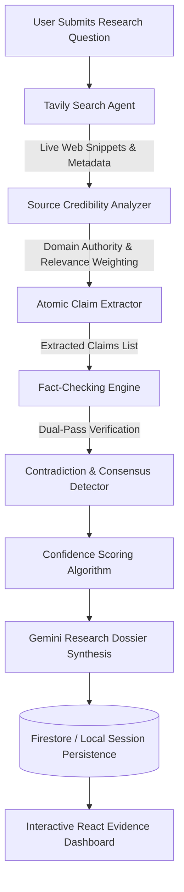

<div align="center">


### Autonomous Multi-Agent Research & Fact-Verification Platform

*Eliminate hallucinations. Validate facts against empirical live web evidence. Audit contradictions.*

---

[](https://fastapi.tiangolo.com/)
[](https://www.python.org/)
[](https://react.dev/)
[](https://vitejs.dev/)
[](https://tailwindcss.com/)
[](https://ai.google.dev/)
[](https://tavily.com/)
[](https://firebase.google.com/)
[](./LICENSE)

</div>

---

## 📖 Table of Contents

- [Overview](#-overview)
- [How It Works](#-how-it-works)
- [Key Features](#-key-features)
- [Confidence Scoring Model](#-confidence-scoring-model)
- [System Architecture](#-system-architecture)
- [Project Structure](#-project-structure)
- [Getting Started](#-getting-started)
  - [Prerequisites](#prerequisites)
  - [Clone the Repository](#1-clone-the-repository)
  - [Backend Setup](#2-backend-setup)
  - [Frontend Setup](#3-frontend-setup)
  - [Running the Application](#4-running-the-application)
- [Environment Configuration](#-environment-configuration)
- [API Reference](#-api-reference)
- [Testing & Quality Assurance](#-testing--quality-assurance)
- [Contributing](#-contributing)
- [License](#-license)

---

## 🌟 Overview

**VeriSearch AI** is an autonomous multi-agent platform designed to conduct rigorous, objective research and fact-checking. Modern LLMs frequently produce convincing but inaccurate statements ("hallucinations"). VeriSearch AI solves this by decoupling generative reasoning from truth grounding:

1. **Retrieves live empirical evidence** across the web using Tavily's search engine.
2. **Evaluates source credibility and freshness** across authority domains.
3. **Deconstructs claims atomically** using Google Gemini (2.5 Flash / Flash Lite).
4. **Validates each claim against retrieved evidence** with strict verification criteria.
5. **Audits opposing evidence to detect contradictions**.
6. **Computes a multi-dimensional confidence score** and generates a structured research dossier.

---

## 🔄 How It Works



1. **Query Ingestion**: The user inputs an open question, hypothesis, or factual claim.
2. **Evidence Retrieval**: Tavily executes targeted web queries to extract live, high-signal snippets and citations.
3. **Source Analysis**: Domains are assessed for authority, publication recency, and semantic relevance to the question.
4. **Claim Decomposition**: Gemini breaks down the investigation into discrete, testable atomic claims.
5. **Strict Evidence Verification**: Each claim is independently tested against source snippets, resulting in verdicts:
   - `Supported` — Solid backing across reputable sources.
   - `Partially Supported` — Supported with caveats or nuances.
   - `Contradicted` — Directly refuted by reliable findings.
   - `Unverified` — Insufficient empirical evidence to substantiate.
6. **Contradiction Detection**: Cross-checks sources to identify conflicting facts or disagreements among publications.
7. **Synthesis & Scoring**: A 6-factor mathematical confidence score is generated alongside an executive summary and full markdown report.

---

## ✨ Key Features

- 🔍 **Autonomous Deep Search**: Deep web search querying powered by Tavily with automatic keyword synthesis.
- 📊 **Dynamic Evidence Alignment Matrix**: Clear, categorized claims matrix highlighting empirical consensus, caveats, and refutations.
- ⚖️ **Contradiction Analysis**: Flags disagreements between news outlets, studies, or online sources with explanatory notes.
- 🌐 **Source Reputation & Freshness Engine**: Domain authority weighting (`high`, `medium`, `low`), citation URLs, and publication age evaluation.
- 📈 **Weighted Confidence Score (0–100%)**: Transparent, formula-driven metric rather than an opaque LLM guess.
- 📝 **Markdown & PDF Export**: Instant report generation for researchers, journalists, and students.
- 🔐 **Built-in Session Authentication**: Cookie-based secure sessions (`httpOnly`), password hashing, and user-isolated audit histories.
- 🔄 **Fault-Tolerant Fallback**: Autonomous evidence synthesis kicks in seamlessly if external AI APIs reach rate limits or are offline.

---

## 🧮 Confidence Scoring Model

VeriSearch AI calculates overall research confidence using a deterministic, multi-factor weighting algorithm:

$$\text{Confidence} = \sum (W_i \times S_i) \times 100$$

| Metric | Weight ($W_i$) | Description |
|---|---|---|
| **Source Quality** | **24%** | Weighted credibility score of retrieved domains (`high`: 1.0, `medium`: 0.7, `low`: 0.25). |
| **Relevance** | **23%** | Average semantic alignment between retrieved sources and the research question. |
| **Claim Certainty** | **23%** | Mean confidence level of atomic fact-checked claims. |
| **Agreement / Consensus** | **15%** | Penalty factor applied based on number of contradictions detected across sources. |
| **Source Freshness** | **8%** | Decay penalty applied to stale sources based on publication date. |
| **Evidence Coverage** | **7%** | Source breadth (scaled up to 5+ distinct corroborating sources). |

---

## 🏛️ System Architecture

VeriSearch AI is structured as a modular monorepo containing a high-throughput Python backend and a modern React frontend:

```text
VeriSearchAI/
├── autonomous-research-agent/
│   ├── backend/                     # FastAPI Python Backend
│   │   ├── app/
│   │   │   ├── agents/              # Multi-agent logic (research, fact-checker, source analyzer)
│   │   │   ├── api/                 # REST endpoints (/research, /auth, /health)
│   │   │   ├── core/                # Configuration, security, Firebase initialization
│   │   │   ├── models/              # Pydantic data schemas
│   │   │   ├── services/            # Tavily, Gemini, Firebase, and Auth services
│   │   │   ├── utils/               # Text processing and normalization
│   │   │   └── main.py              # Application entrypoint & CORS middleware
│   │   ├── tests/                   # Pytest test suite
│   │   ├── requirements.txt         # Python dependencies
│   │   └── .env.example             # Backend environment template
│   │
│   └── frontend/                    # React 19 + Vite 8 Frontend
│       ├── public/                  # Brand logos, icons, and static assets
│       ├── src/
│       │   ├── auth/                # AuthContext and session state hooks
│       │   ├── components/          # Reusable UI & research visualization components
│       │   ├── pages/               # Dashboard, Research, Results, History, Settings
│       │   ├── services/            # Axios API client
│       │   └── App.jsx              # Client router with protected routes
│       ├── package.json             # Frontend dependencies
│       └── README.md                # Frontend documentation
│
├── package.json                     # Monorepo task runner
└── README.md                        # Master repository documentation
```

---

## 🚀 Getting Started

### Prerequisites

- **Python**: `3.10` or higher (tested on Python `3.13`)
- **Node.js**: `v18.0.0` or higher
- **API Keys**:
  - [Google Gemini API Key](https://aistudio.google.com/) (`AIza...`)
  - [Tavily Search API Key](https://tavily.com/) (`tvly-...`)
  - *(Optional)* Firebase service account credentials (a local fallback store is provided if Firebase is not configured).

---

### 1. Clone the Repository

```bash
git clone https://github.com/Pragya291/VeriSearchAI.git
cd VeriSearchAI
```

---

### 2. Backend Setup

1. Navigate to the backend directory and create a virtual environment:
   ```bash
   cd autonomous-research-agent/backend
   python -m venv venv
   ```

2. Activate the virtual environment:
   - **Windows (PowerShell)**:
     ```powershell
     .\venv\Scripts\Activate.ps1
     ```
   - **macOS / Linux**:
     ```bash
     source venv/bin/activate
     ```

3. Install backend dependencies:
   ```bash
   pip install -r requirements.txt
   ```

4. Configure your `.env` file:
   ```bash
   cp .env.example .env
   ```
   Edit `.env` and insert your API keys:
   ```env
   GEMINI_API_KEY="AIzaSy..."
   TAVILY_API_KEY="tvly-..."
   ```

5. Start the backend development server:
   ```bash
   python -m uvicorn app.main:app --port 8000 --reload
   ```
   *The backend will now be live at `http://localhost:8000` (Interactive API docs at `http://localhost:8000/docs`).*

---

### 3. Frontend Setup

1. Open a new terminal and navigate to the frontend directory:
   ```bash
   cd autonomous-research-agent/frontend
   ```

2. Install dependencies:
   ```bash
   npm install
   ```

3. Configure `.env`:
   ```env
   VITE_API_BASE_URL=http://localhost:8000
   VITE_API_URL=http://localhost:8000
   ```

4. Start the frontend development server:
   ```bash
   npm run dev
   ```
   *The frontend will launch at `http://localhost:5173`.*

---

### 4. Running via Monorepo Root

From the repository root, install dependencies and run both services:

```bash
npm install
npm run dev           # Starts the React frontend
npm run dev:backend   # Starts the FastAPI backend (Windows)
```

---

## ⚙️ Environment Configuration

### Backend (`autonomous-research-agent/backend/.env`)

| Variable | Type | Description |
|---|---|---|
| `APP_NAME` | string | Name of the FastAPI application. |
| `ENV` | string | `development` or `production`. |
| `DEBUG` | boolean | Enables debug logs and stack trace capture. |
| `GEMINI_API_KEY` | string | Google Gemini API key (`AIza...`). |
| `TAVILY_API_KEY` | string | Tavily AI search API key (`tvly-...`). |
| `AUTH_SESSION_DAYS` | integer | Session duration in days (default: `14`). |
| `AUTH_COOKIE_SECURE` | boolean | Set `True` when serving over HTTPS. |
| `FIREBASE_PROJECT_ID`| string | *(Optional)* Firebase project identifier. |
| `FIREBASE_CLIENT_EMAIL`| string| *(Optional)* Firebase service account email. |
| `FIREBASE_PRIVATE_KEY`| string | *(Optional)* Firebase RSA private key. |
| `FRONTEND_URL` | string | URL of the frontend for CORS (default: `http://localhost:5173`). |

### Frontend (`autonomous-research-agent/frontend/.env`)

| Variable | Type | Description |
|---|---|---|
| `VITE_API_BASE_URL` | string | Base URL of the backend API (`http://localhost:8000`). |
| `VITE_API_URL` | string | API endpoint alias (`http://localhost:8000`). |

---

## 📡 API Reference

When the backend is running, complete interactive OpenAPI documentation is available at:
- **Swagger UI**: `http://localhost:8000/docs`
- **ReDoc**: `http://localhost:8000/redoc`

### Core Endpoints

| Method | Endpoint | Description |
|---|---|---|
| `POST` | `/api/research` | Triggers an autonomous research workflow for a given query. |
| `GET` | `/api/research/{research_id}` | Retrieves the full verified report, claims matrix, and sources. |
| `GET` | `/api/research` | Returns paginated research history (`page`, `limit`). |
| `POST` | `/api/auth/signup` | Creates a new researcher account. |
| `POST` | `/api/auth/login` | Authenticates user and issues an `httpOnly` session cookie. |
| `GET` | `/api/auth/me` | Retrieves the currently authenticated user's session. |
| `POST` | `/api/auth/logout` | Revokes the current session and clears the cookie. |
| `GET` | `/api/health` | Service health status check. |

---

## 🧪 Testing & Quality Assurance

### Backend Unit & Integration Tests

Run the test suite with `pytest`:

```bash
cd autonomous-research-agent/backend
# Set PYTHONPATH to root of backend
$env:PYTHONPATH="."        # PowerShell
export PYTHONPATH="."      # Bash / Linux
pytest tests/
```

### Frontend Code Quality

Run `oxlint` for high-speed static linting:

```bash
cd autonomous-research-agent/frontend
npm run lint
```

---

## 🤝 Contributing

Contributions are welcome! Follow these steps to contribute:

1. Fork the repository.
2. Create your feature branch (`git checkout -b feature/AmazingFeature`).
3. Commit your changes (`git commit -m 'Add some AmazingFeature'`).
4. Push to the branch (`git push origin feature/AmazingFeature`).
5. Open a Pull Request.

---

## 📄 License

This project is licensed under the MIT License — see the [LICENSE](LICENSE) file for details.

<div align="center">
  <sub>Built with ❤️ by <a href="https://github.com/Pragya291">Pragya</a> and the VeriSearch AI Community.</sub>
</div>
